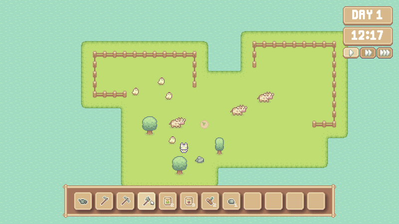
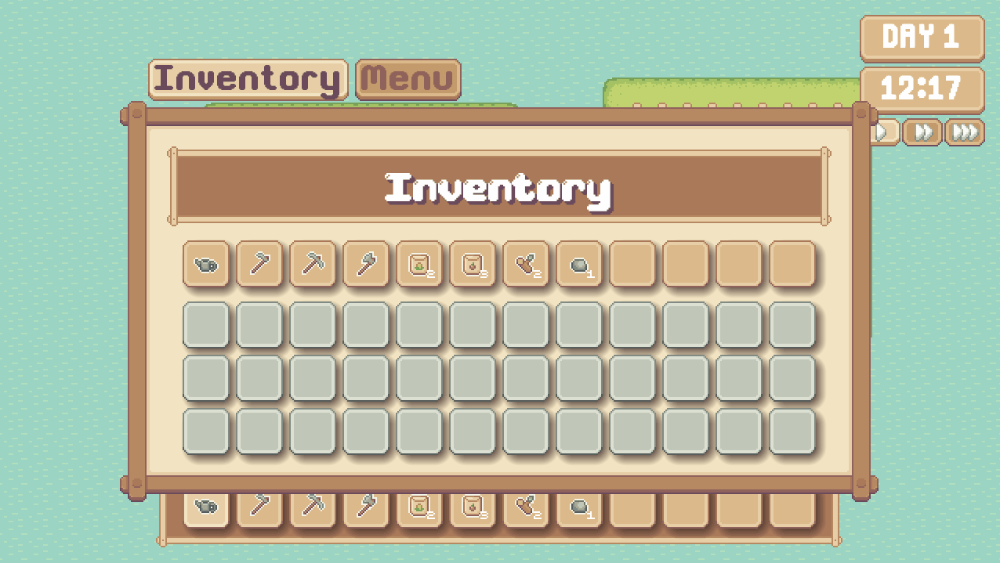
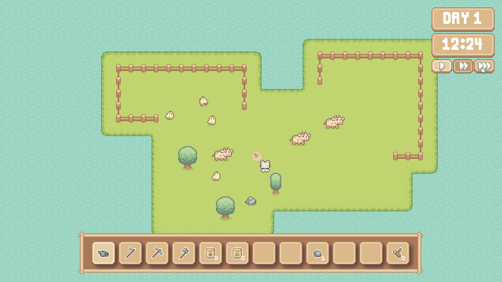
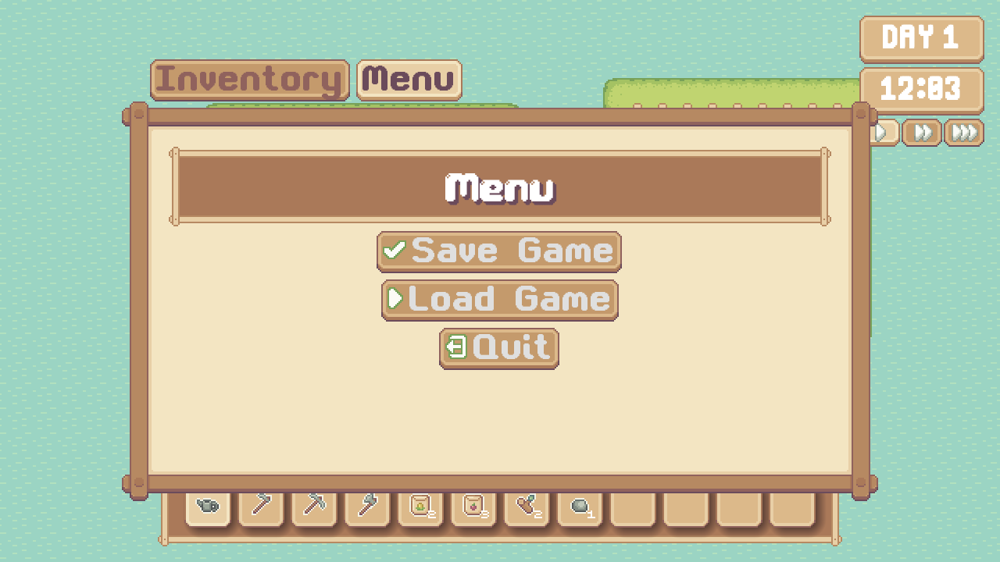

# 🌱 FarmSim

A cozy farming simulation game built in Godot 4 — currently in early development.

> ⚠️ This project is in very early stages. It is a functional tech demo, not a polished game experience — yet. 



---

## Features

### 🌾 Crop Farming

Plant, water, and harvest crops across multiple growth stages. Growth progression is calculated automatically based on configurable stages and days until harvest. Unwatered crops won't advance — so don't forget to water! Currently supports corn and tomatoes.

### 🪓 Resource Gathering

Chop trees and mine rocks using tools. Each resource has configurable hit points before breaking.

### 🐄 NPC Animals

Cows and chickens roam the map with automatic pathfinding, collision correction, and randomized ambient sounds.

### 🎒 Inventory System

A signal-driven inventory with a hotbar, drag-and-drop reordering, and item stacking. Backed by an item database for easy expansion.

### ☀️ Day/Night Cycle

Time passes in real time with an in-game clock and day counter. Lighting shifts dynamically to simulate sunrise and sunset. Time can be paused or sped up via the menu.

### 💾 Save/Load System

Full game state persistence via JSON. Saves and restores player position, inventory, crop growth stages, resource health, tilled soil, and animal positions.

---

## Controls

| Input | Action |
|---|---|
| `WASD` | Move |
| `E` | Open / close menu |
| `Left Click` | Use selected tool or item |
| `Right Click` | Interact *(not yet implemented)* |

---

## Tech Stack

- **Engine:** Godot 4.6.1
- **Language:** GDScript
- **Persistence:** JSON via Godot's FileAccess API

---

## Getting Started

### Play the Game
Prebuilt versions for Windows, Linux, and macOS are available on the [Releases](https://github.com/nova-denton-parry/farmsim-godot/releases) page — no installation or assets required.

### Build from Source
> ⚠️ This project uses licensed assets that are **not included** in this repository and cannot be redistributed. The project will not run out of the box without the required asset packs.

If you have the required assets, clone the repo and open `project.godot` in Godot 4.6.1 or later.

```bash
git clone https://github.com/nova-denton-parry/farmsim-godot.git
```

---

## Roadmap

## Roadmap

Development is tracked via the [FarmSim Roadmap](https://github.com/users/nova-denton-parry/projects/1) project board.

Planned features include:
- 🌳 Resource respawning
- 💰 Economy system
- 🐄 Animal produce spawning
- 🏠 Placeable objects
- 🎯 Interaction area improvements
- 💾 Save system refactor
- And more!

---

## Contributing

This is a solo personal project and is not currently open to external contributions. Feel free to fork the repo and experiment on your own!

---

## Credits

### Pixel Art Assets ( + one font )
[CupNooble](https://cupnooble.itch.io/) — licensed for commercial use

### All Other Fonts
[Vexed](https://v3x3d.itch.io/) — licensed under [CC Attribution 4.0 International](https://creativecommons.org/licenses/by/4.0/deed.en).

### Music
[Pegonthetrack](https://pegonthetrack.itch.io/) & [ElvGames](https://elvgames.itch.io/) — licensed for commercial use

### Sound Effects
[Epic Stock Media](https://epicstockmedia.itch.io/) — licensed for commercial use

---

## License

This project is licensed under the **GNU General Public License v3.0**. See [LICENSE](LICENSE) for details.

---

*Built by [Nova Denton-Parry](https://github.com/nova-denton-parry) — developer by study, builder by nature.*
